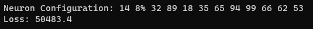

# Genetic Neural Network Builder
Genetic Neural Network Builder is an open source C++ project that utlizes a genetic algorithim to find the ideal neural nerwork architecture to minimize loss.

The algorithim utilizes PyTorch's C++ library for the training of each neural network, the rest of the algorithim was written from scratch.

The crossover operation used is "Uniform Crossover".

The mutation operations used is a altered version of Uniform Crossover where an ideal chromosone and a random chromosone are used to create a mutated child.

The program utilizes "Generalized Loss" for early stopping when training neural networks.

Genetic Neural Netowrk Builder supports CUDA usage during neural netowrk training.

## How It Works 
1. The algorithim initially creates a population of N random chromosones that represent the architecture of neural networks. 

2. The algorithim will then iteratre through the population of chromosones, transforming each chromosone into a neural network with PyTorch's C++ library.

3. Each neural network is then trained and validated with the user provided data. The loss value of each neural network is then assigned to the corresponding chromosone.

4. The algorithim then chooses the M best chromosones to repopulate. 

5. A new population is then initialized by the offspring of the M best chromosones. 

6. Go to step 2 and restart the process over again until K iterations have been completed.

## Results
This algorithim reduced the Root Mean Squared Error of one of my models by over 10% with a P-Value of 0.0001.  


## Example Usage
```c++
#include <iostream>

// Importing Genetic Algorithim
#include "Genetic.h"

int main() {

    // Defining the paths of the training and validation data
	const std::string TRAIN_FILE = "training.csv";
	const std::string VALIDATION_FILE = "validation.csv";

    // Defining Genetic Algorithim Parameters
	const int POPULATION_SIZE = 100;
	const int IN_SHAPE = 7;
	const int MAX_EPOCHS = 100;

	const float LEARNING_RATE = 0.001;

	const int BATCH_SIZE = 32;
	const int MAX_LAYERS = 30;
	const int MAX_NEURONS = 100;
	const int DROPOUT_LAYER_PROBABILITY = 0.05;
	const int MUTATION_PROBABILITY = 0.01;
	const int GENERATIONS = 200;


    // Initializing instance of the Genetic Algorithim
	Genetic genAlgo(TRAIN_FILE, VALIDATION_FILE, POPULATION_SIZE, IN_SHAPE, MAX_EPOCHS, LEARNING_RATE, BATCH_SIZE, MAX_LAYERS, MAX_NEURONS, DROPOUT_LAYER_PROBABILITY, MUTATION_PROBABILITY, GENERATIONS);

    // Training Genetic Algorithim
	genAlgo.Train();

    // Prining the solution 
	genAlgo.PrintBest();

}

```

## Output

### Generation Statistics


Each generation the following statistics are printed: 

* Generation Number
* Average Loss
* Min Loss
* Max Loss
* Standard Deviation
* Average Change
* P-Value
* Average Change (from the first generation)
* P-Value (from the first generation)

### Final Output


Note: The layer containg 8% neurons means a dropout layer with 8% chance of dropout
